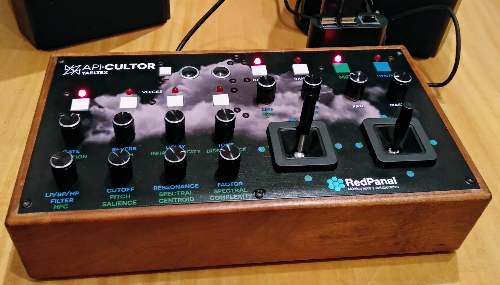
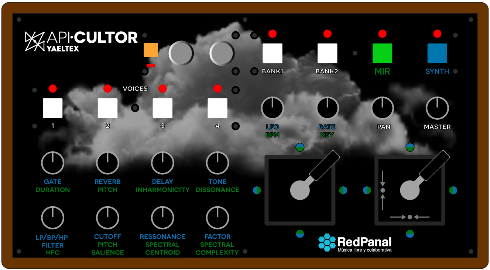
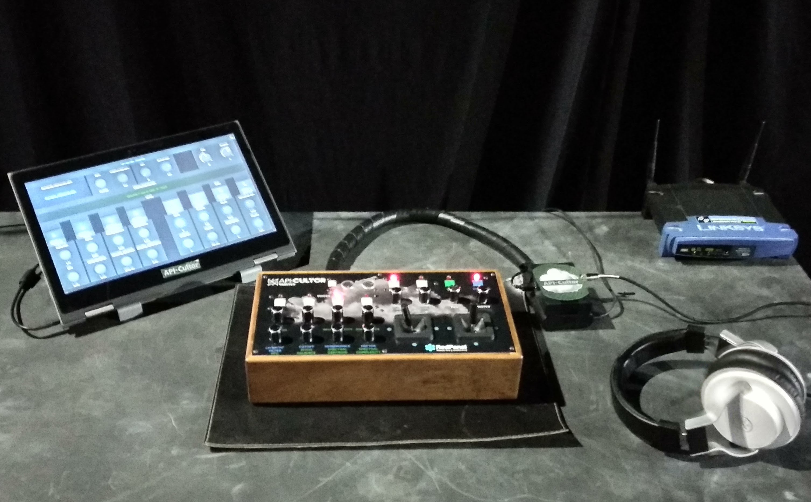

# Raspicultor

Custom MIDI Controller plus a Raspberry Pi 3 (model B) running Supercollider as a synthesizer and effects processor. Using an external USB sound card for high fidelity.

Based in API.Cultor: https://github.com/sonidosmutantes/apicultor

Built by [Yaeltex](https://yaeltex.com/en) custom MIDI controllers.

## License

Free Software shared with GPL v3, see [LICENSE](LICENSE).

## How to perform with it?

See the [User Guide](User-Guide.pdf) for more details.

## Configuration

* Install dependencies (Linux, MacOS, Windows or raspberry pi)
* Create a config file with Freesound api key (or config another database service)

    For Freesound: [APIv2 APPLY](http://www.freesound.org/apiv2/apply/)
    (and use this callback https://www.freesound.org/home/app_permissions/permission_granted/)
    And we get something like:
        API_KEY = "asga2823235r48qklasdjl3khfasdflk2"

    Then create a file named ".config.json" in the raspicultor/ path:
        {
            "sound.synth": "supercollider",
            "api": "freesound",
            "Freesound.org": [
                { "API_KEY": ""
                }
            ]
        }
* Run ./CloudInstrument.py
* If you are going to use SuperCollider run first. Note: sends broadcast OSC message to the network.
    $ sclang -D apicultor_synth.scd
* Run OpenStageControl with ui/apicultor-ui.json (osc receiving port 7000)
* Play with it! Describe sounds with MIR descriptor search them in the Cloud, then use integrated realtime processes with them (granular synth, reverb, delay, LP/HP filters, etc).

 Dependencies: [INSTALL.md](INSTALL.md)

# Use

# FX Chain

        freeze -> vibrato -> pan-> pithshift -> filters -> delay -> reverb

### Linux: jackd-no-disconnect-config 
~/.jackdrc

    /usr/local/bin/jackd -P75 -t2000 -dalsa -dhw:S2 -p4096 -n7 -r44100 -s

### (optional) External UI for visual feedback

Running a browser in an external computer, tablet, mobile phone, etc.

[Open Stage Control](https://osc.ammd.net/) User Interface

# Recognition

* Interview: https://www.youtube.com/watch?v=pFosDJJtylk
* Cloud Instrument mention in [ArCiTec prize, Technology applied to Arts](https://arcitec.frba.utn.edu.ar/tecnologia-aplicada-al-arte/) (2018).
* Publication: [Sound recycling from public databases](https://www.researchgate.net/publication/317388443_Sound_recycling_from_public_databases) @ [Audio Mostly](http://audiomostly.com) 2017 

# Art installations

Sounds from the Cloud installation.
